# Introduction

### The project _" library automation system "_ is divided in two repositoires 
1. [The Library System](https://github.com/yashkathe/Library-Automation-System) (On premise system)
2. [Library Portal](https://github.com/yashkathe/Library-Portal) (Website application)

# Final Project Model

    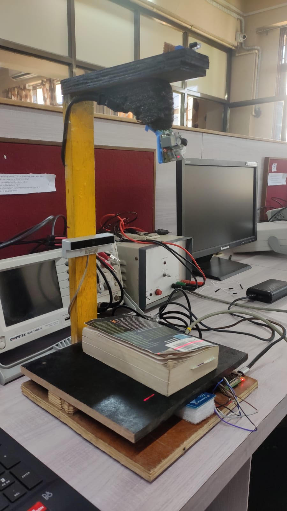

# Motivation 

A library is a place of endless knowledge, offering a variety of resources for people of all ages. From classic literature and new fiction to educational materials and reference books, libraries provide an incredible wealth of information. It is a gateway to providing resources and services that shape new opportunities for learning and gaining knowledge. As managing a big traditional library could be a daunting task, I believe that my project would be an excellent way to reduce the interaction between the Library staff and the users and manage the task efficiently.

My project automates the task of issuing and returning books. It also helps to create a centralized system, portal and database for books, users and admins which assists the already existing system. A Raspberry Pi is used as the central hardware component where the database is maintained, the web server is hosted, as well asother necessary RFID scripts are running. The system is based on Admin-Client Interaction.

Library Automation System is a technique of maintaining and surveying books at the Library so that books are distributed and managed effectively. Digitizing libraries can help retrieve books quickly, store large amounts of data, have a long operating life, and have a low-cost advantage. It is the information and scientific trend of book management. It also eliminates the need for security personnel by employing Radio Frequency Identification (RFID) technology.

# Methodology

The user needs to sign in first with his/her credentials and then get a uniquely generated Quick Response (QR) Code. There will be an Infrared radiation (IR) sensor placed which will detect the person and start the process. By scanning the QR code using a webcam, the user can log into their account at the library. After logging into the student account, there are two options for the issuance and return of books. Based on the option selected the student has to place the book under a barcode scanner. The International Standard Book Number (ISBN) on the book is scanned and the details are fetched from the Google Books API which updates the database accordingly.

The admin login allows administrators to update books and add new ones. Here the admin scans the book’s ISBN using a barcode scanner which fetches data from the Google Books API. The admin has to verify the data and enter the quantity. When similar books are already present, it shows that similar books already exist. Even after continuing, it stores the book data and updates the number of books that are already present. The whole system becomes more secure by having RFID tags attached to every book. These tags would raise an alarm if the book is taken out of the premises without being issued. The portal will allow students to check book availability.

    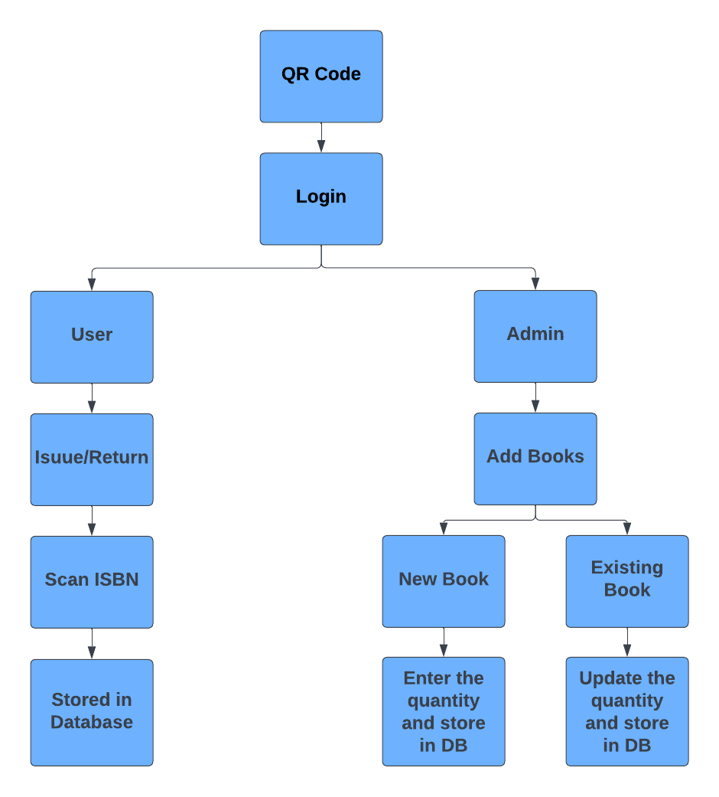

# System Design

The architectural design is divided into Client and the Admin side. It specifies the working process for both users and administrators.

    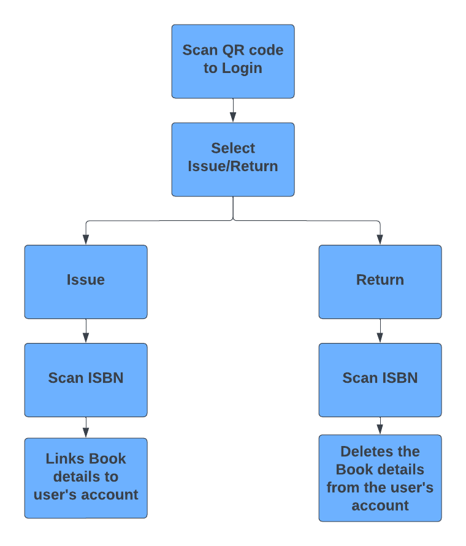

The process begins with the user signing into his account from his mobile device. Then the user gets a unique auto-generated QR code. This QR code acts as an identification which must be scanned. This QR code can be saved so the user does not have to log in again. The web camera interfaced with the Raspberry Pi scans the QR code and authenticates the user. The user has the option to decide whether to issue or return the book. Either of these processes includes scanning the ISBN on the book.

    

An ISBN is a unique number assigned to every published book. The ISBN number is encoded into an EAN-13 barcode as shown above. Once the ISBN has been scanned successfully, the book details are fetched from the Google Books API by providing the decoded ISBN. The respective schema including the time stamp, user ID, and book details is then stored in the database

    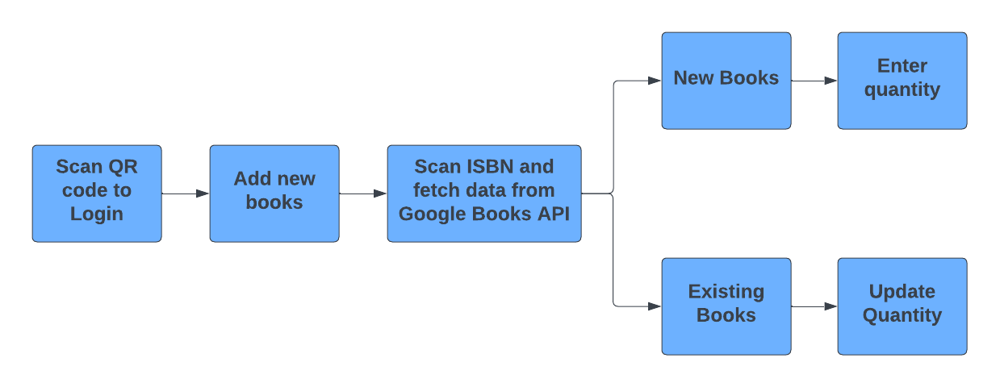

The admin needs to log in using their respective credentials. In order to add new books to the database, the admin has to scan the ISBN of the new book, check the data and enter the quantity of the books. If there is a book with the same title it shows a message of a similar title exists. If the admin still wants to add the data then gets stored in the database. This schema includes a timestamp and book details.

# UI 

This is the User Interface for on-premise System. The Process starts when the User interacts with the IR Sensor. IR transmitter continuously emits the IR light and the IR receiver checks for reflected light. When light hits the person in front of it, it is reflected back and received by the IR receiver.

    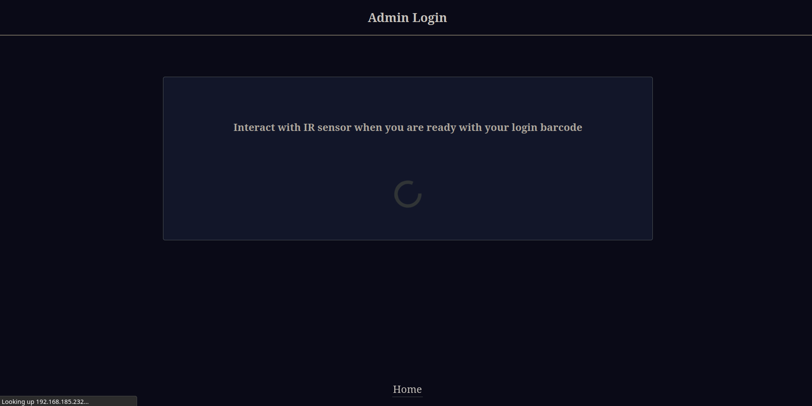

When IR sensor detects the user it starts the process. It lets the user know that he/she has to place QR Code in order to log in.

    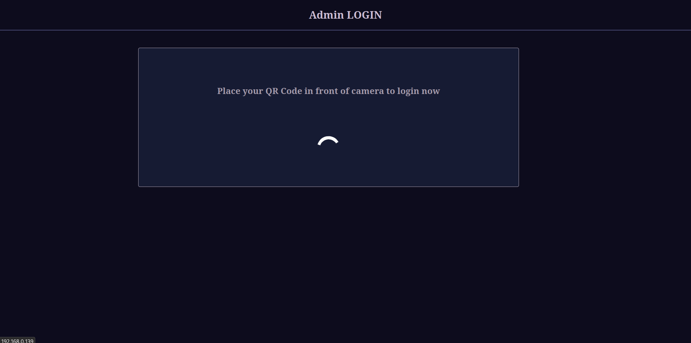

## Admin

For the Librarian login, the admin has the feature of storing books in the database. The figure below represents the web page where the book data is fetched after scanning ISBN and the Librarian can add the book quantity.

    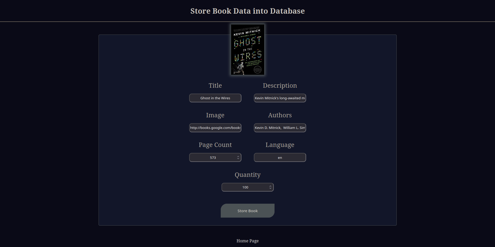

The system alerts the administrator if they attempt to add a book that already exists in the database. The admin can then just update the quantity of the book in the database. This scenario can happen when a new stock of the same book has arrived.

    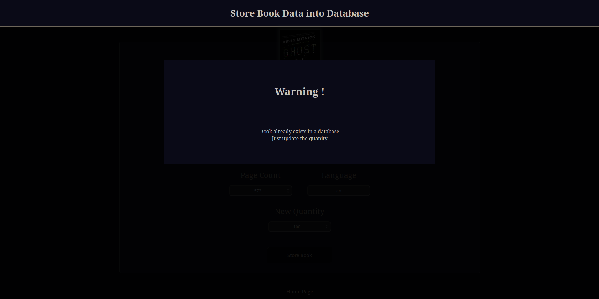

The admin is given the choice of adding another book or ending the process after storing the book. As a result, the administrator can add several books without having to log in again repeatedly.

    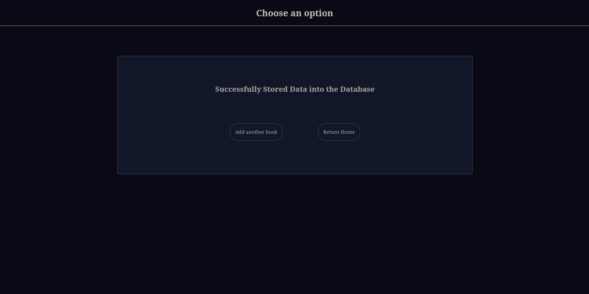

## Client

For the client side the students must use the issue or return QR code from the webapp. The system automatically determines whether a book is being issued or returned. This is achieved by decoding the QR code and then examining its format.

    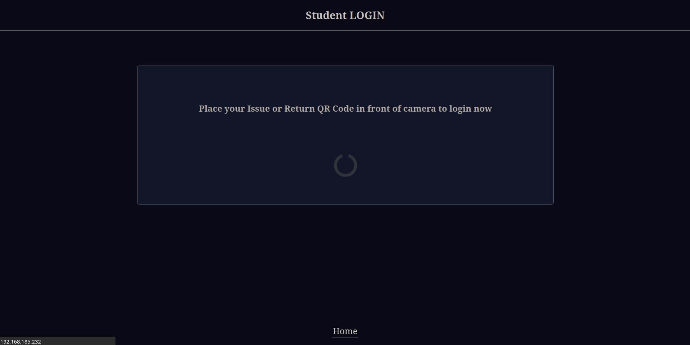

Any book must be issued with a single QR code. The student’s ObjectId is encoded in the QRcode. The student ObjectId is saved in a session after a student logs in using his QR code. This ObjectId is then accessed by the system while executing database querie.

    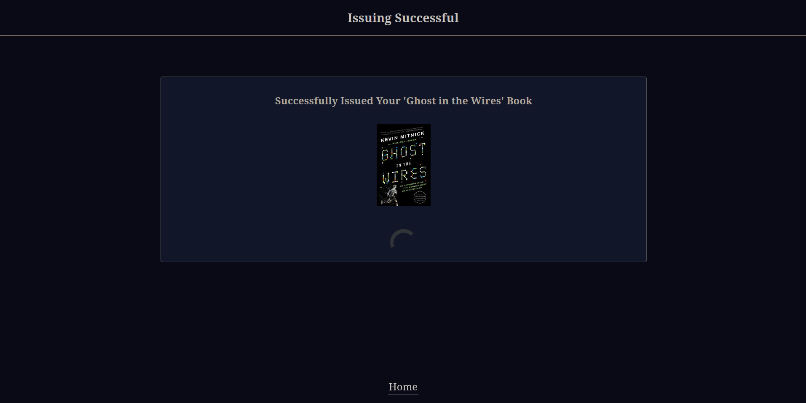

Each book that has to be returned has a different QR code with fixed format that can be used to return books. The format for it is as follows: userId @ ISBN

    

The system separates both the values and then userId and the book’s ISBN is stored in flask-sessions. A flask-session is used to store information related to a user, across different requests, as they interact with a web app. By having access to these values, it is possible to get the session-data and run database queries easily. The system also verifies that the ISBN from the decoded QRcode matches with the ISBN scanned by the barcode scanner. This is carried out to make sure the student actually brought the book into the library while returning the book. These sessions are destroyed after each user login

# Conclusion

Many libraries today find it difficult to manage all the workloads and a large number of customers. To mitigate such problems we have developed a user interface which makes it easier for clients to log into their account. With the help of this interface, it is easier to keep track of books that have been issued or returned to the library. The QR code and ISBN scanner work very efficiently and reduce the librarian’s work. With the help of the Google Books API, users and administrators can view details about the books. By providing these features, our main aim is to make a completely self-service automated system for the clients as well as the staff so that they can work through the process faster and more efficiently.